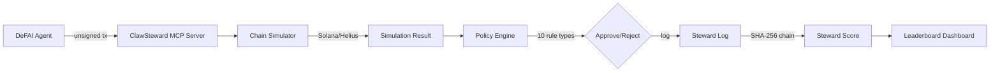

# ClawSteward

**Pre-signing policy enforcement gate and behavioral reputation system for DeFAI agents.**

[](LICENSE)
[]()
[](https://nodejs.org)
[](https://www.typescriptlang.org)
[](https://solana.com)

By [ClawStack](https://clawstack.dev) · [@SkunkWorks0x](https://x.com/SkunkWorks0x)

---

## The Problem

DeFAI agents are executing financial transactions autonomously — swaps, yield farming, portfolio rebalancing — with zero policy enforcement and no audit trail. There's no way to know if an agent violated risk limits until after the damage is done. Agent operators have no behavioral reputation signal to assess trustworthiness.

## How ClawSteward Works

1. **DeFAI agent submits an unsigned transaction** to ClawSteward via MCP server
2. **ClawSteward simulates it** against Solana (devnet/mainnet via Helius RPC)
3. **Evaluates against configurable policy rules** (10 rule types, chain-abstract DSL)
4. **Approves or rejects** with detailed reasoning and violation breakdown
5. **Logs every decision** to a tamper-evident Steward Log (SHA-256 hash chain)
6. **Derives a 0–10 Steward Score** from behavioral history
7. **Exposes scores** via MCP read endpoint + public Steward Leaderboard



## Quick Start

```bash
git clone https://github.com/SkunkWorks0x/clawsteward.git
cd clawsteward
pnpm install
pnpm build

# Register an agent
node dist/index.js register --name "my-agent" --chain solana --address <PUBKEY>

# Start MCP server (for AI agent integration)
node dist/index.js serve

# View Steward Score
node dist/index.js score <AGENT_ID>

# Generate report
node dist/index.js scan --agent <AGENT_ID> --report

# Launch dashboard
cd dashboard && pnpm install && pnpm dev
```

## MCP Integration

ClawSteward exposes an MCP server (stdio transport) with 5 tools:

| Tool | Description |
|------|-------------|
| `steward_evaluate` | Submit an unsigned transaction for policy evaluation |
| `steward_register` | Register a new agent with ClawSteward |
| `steward_score` | Get an agent's current Steward Score and badge |
| `steward_leaderboard` | Ranked list of all agents by score |
| `steward_scan` | Detailed behavioral scan with violation breakdown |

### MCP Client Configuration

Add ClawSteward to any MCP-compatible client:

```json
{
  "mcpServers": {
    "clawsteward": {
      "command": "node",
      "args": ["dist/index.js", "serve"],
      "env": {
        "STEWARD_DB_PATH": "./data/clawsteward.db",
        "HELIUS_API_KEY": "your-helius-key"
      }
    }
  }
}
```

## Policy Rules

All rules use chain-abstract units (USD, percentages, counts). The chain adapter translates chain-specific data before evaluation.

| Rule Type | Description | Example Config |
|-----------|-------------|----------------|
| `max_usd_value` | Cap the USD value of a single transaction | `{"max": 10000}` |
| `max_slippage_pct` | Maximum allowed slippage percentage | `{"max": 3.0}` |
| `velocity_24h_usd` | Rolling 24-hour USD volume cap | `{"max": 50000}` |
| `velocity_1h_count` | Maximum transactions per hour | `{"max": 20}` |
| `blacklist_counterparties` | Block transactions involving specific addresses | `{"addresses": ["Bad1...", "Bad2..."]}` |
| `whitelist_programs` | Only allow interactions with approved programs | `{"programs": ["JUP...", "RAY..."]}` |
| `concentration_pct` | Max portfolio percentage in a single asset | `{"max": 25}` |
| `auto_pause_consecutive_violations` | Auto-pause agent after N violations in a time window | `{"threshold": 3, "window_minutes": 60}` |
| `max_position_usd` | Maximum single position size in USD | `{"max": 25000}` |
| `custom` | User-defined rule with custom evaluation logic | `{"evaluator": "custom_fn_name"}` |

Policy files live in `policies/`. See `policies/examples/` for conservative, aggressive, and institutional templates.

## Steward Score Methodology

The Steward Score is a deterministic 0–10 behavioral reputation score derived from audit log history.

**Calculation:** `Score = 10.0 × (1 - WeightedViolationRate)`

**Severity weights:**

| Severity | Weight |
|----------|--------|
| Critical | 1.0 |
| High | 0.6 |
| Medium | 0.3 |
| Low | 0.1 |

**Time decay:**
- Last 100 evaluations weighted **3x** vs historical
- Evaluations older than 90 days weighted **0.5x**

**Badge tiers:**

| Score | Badge | Meaning |
|-------|-------|---------|
| 8.0 – 10.0 | ClawSteward-verified | Consistently compliant behavior |
| 5.0 – 7.9 | Under Review | Mixed compliance record |
| 0.0 – 4.9 | High Risk | Frequent or severe violations |
| `null` | Insufficient Data | Fewer than 10 evaluations |

Agents with score ≥ 8 earn the **ClawSteward-verified** badge.

## CLI Reference

| Command | Syntax | Description |
|---------|--------|-------------|
| `serve` | `clawsteward serve [--port <n>]` | Start MCP server on stdio transport |
| `register` | `clawsteward register --name <name> --chain solana --address <pubkey>` | Register a new agent |
| `score` | `clawsteward score <agent_id>` | Query the Steward Score for an agent |
| `scan` | `clawsteward scan --agent <id> [--days <n>] [--report]` | Scan evaluation history or generate a report |
| `leaderboard` | `clawsteward leaderboard [--limit <n>]` | View ranked Steward Leaderboard |
| `export` | `clawsteward export --agent <id> [--format json\|csv]` | Export Steward Log entries |
| `verify` | `clawsteward verify` | Verify Steward Log hash chain integrity |
| `dashboard` | `clawsteward dashboard [--port <n>]` | Start the Steward Dashboard (v0.2) |

**Global flags:**

| Flag | Description | Default |
|------|-------------|---------|
| `--db <path>` | Path to SQLite database | `./steward.db` |
| `--verbose` | Enable debug output | `false` |
| `--version` | Print version and exit | — |
| `--help` | Print help and exit | — |

## Dashboard

> *Screenshot placeholder — real screenshots will be added on ship day.*

The **Steward Leaderboard** is a public dashboard showing all registered agents ranked by Steward Score, with violation history and behavioral trends. Built with Next.js 15 and Tailwind CSS v4. Dark mode with ClawStack orange accents.

- **`/`** — Leaderboard table: rank, name, score, trend, violation rate
- **`/agent/[id]`** — Agent detail: score card, violation timeline, compliance breakdown

## Tech Stack

- **Runtime:** Node.js 20+ / TypeScript 5+
- **MCP Server:** [@modelcontextprotocol/sdk](https://www.npmjs.com/package/@modelcontextprotocol/sdk) ^1.0.0
- **Chain Simulation:** [@solana/web3.js](https://www.npmjs.com/package/@solana/web3.js) ^1.95.0 + Helius RPC
- **Policy Engine:** Custom TypeScript DSL parser (chain-abstract)
- **Database:** SQLite via [better-sqlite3](https://www.npmjs.com/package/better-sqlite3) ^11.0.0
- **CLI:** [Commander.js](https://www.npmjs.com/package/commander) ^12.0.0 + [Chalk](https://www.npmjs.com/package/chalk) ^5.3.0
- **Dashboard:** Next.js 15 + Tailwind CSS v4
- **Testing:** Vitest ^2.0.0 (472 tests)
- **Package Manager:** pnpm

## Devnet Testing

ClawSteward can be tested against live Solana devnet infrastructure. These tests validate the full pipeline: RPC simulation, policy evaluation, audit logging, and score computation against real chain data.

```bash
# Set your Helius API key (free at https://www.helius.dev/)
export HELIUS_API_KEY=your-key-here

# Run devnet integration tests
pnpm test:devnet

# Run live demo
pnpm demo:devnet
```

Devnet tests are **skipped by default** in the standard `pnpm test` run — they only execute when `HELIUS_API_KEY` is set and `pnpm test:devnet` is invoked explicitly. This ensures CI stays green without network access.

**Note:** Jupiter Price API serves mainnet prices only. USD estimation tests use the mainnet SOL mint for price lookups, which is valid since price queries don't interact with devnet state. Devnet airdrop faucets may be rate-limited — if the airdrop fails, tests skip gracefully with a warning.

## Chain Support

Currently supports **Solana**. The architecture is chain-agnostic — adding a new chain requires only a new simulator adapter implementing the `ChainSimulator` interface. No changes needed to the policy engine, audit log, or reputation system.

## Security

See [SECURITY.md](./SECURITY.md) for the full security audit report. ClawSteward v0.1.0 has 0 critical and 0 high severity findings.

## License

MIT

---

Built by [@SkunkWorks0x](https://x.com/SkunkWorks0x) under the [ClawStack](https://clawstack.dev) brand.
